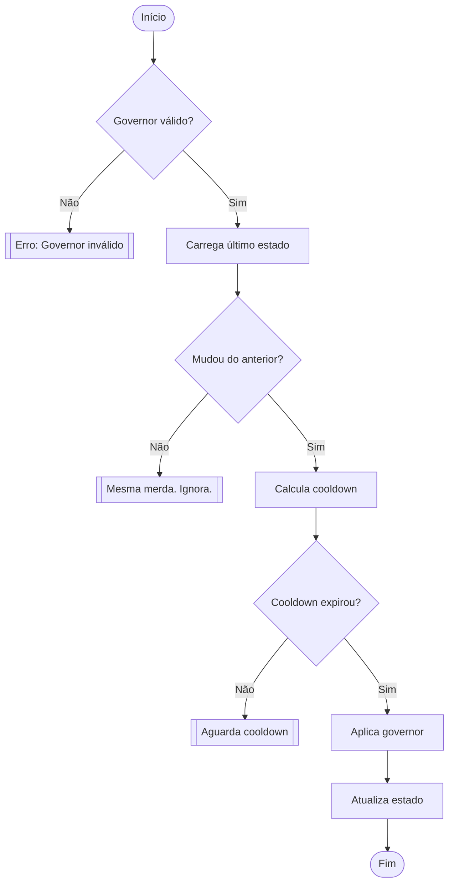

# apply_cpu_governor

Esse script é um **controlador térmico e semântico** de governors da CPU, projetado pra **evitar troca desnecessária, instabilidade, flapping de carga** e outras merdas que podem fazer seu chip rebolar devagarinho. Ele **não troca de governor feito um pamonha**, mas apenas quando a situação realmente pede, e quando troca, o faz com cooldown calculado com base em **temperatura e variância de carga**.

```bash
apply_cpu_governor() {  
    local key="$1"  
    declare -A MAP=(  
        ["000"]="ondemand"  
        ["005"]="ondemand"  
        ["020"]="ondemand"  
        ["040"]="ondemand"  
        ["060"]="performance"  
        ["080"]="performance"  
        ["100"]="performance"  
    )  
    local cpu_gov="${MAP[$key]:-ondemand}"  
    local base_dir="${BASE_DIR:-/tmp}"  
    local last_gov_file="${base_dir}/last_gov"  
    local cooldown_file="${base_dir}/gov_cooldown"  
    local available_govs_file="/sys/devices/system/cpu/cpu0/cpufreq/scaling_available_governors"  
    local now=$(date +%s)  

    # Subfunção: Valida governor  
    is_valid_governor() {  
        grep -qw "$cpu_gov" "$available_govs_file" || {  
            echo "✖ Governor '$cpu_gov' não suportado. Disponíveis: $(cat "$available_govs_file")" >&2  
            return 1  
        }  
    }  

    # Subfunção: Aplica governor em todos os CPUs  
    set_governor_all_cpus() {  
        local gov="$1"  
        for cpu_dir in /sys/devices/system/cpu/cpu[0-9]*; do  
            if [[ -w "$cpu_dir/cpufreq/scaling_governor" ]]; then  
                if ! echo "$gov" > "$cpu_dir/cpufreq/scaling_governor" 2>/dev/null; then  
                    echo "  ‼ Falha ao aplicar '$gov' em $cpu_dir" >&2  
                fi  
            else  
                echo "  ‼ Permissão negada em $cpu_dir" >&2  
            fi  
        done  
    }  

    if ! is_valid_governor "$cpu_gov"; then  
        return 1  
    fi  
 
    local last_gov="none"  
    [[ -f "$last_gov_file" ]] && last_gov=$(cat "$last_gov_file")  

    local last_change=0  
    [[ -f "$cooldown_file" ]] && last_change=$(date -r "$cooldown_file" +%s)  
    local delta=$((now - last_change))  
    local dynamic_cd=$(calc_dynamic_cooldown)  

    echo "⚙ Governor: Key=${key} | Mapeado=${cpu_gov} | Último=${last_gov} | CD=${dynamic_cd}s"  

    if [[ "$cpu_gov" != "$last_gov" ]] && [[ "$delta" -ge "$dynamic_cd" ]]; then  
        echo "  🔄 Aplicando governor..."  
        set_governor_all_cpus "$cpu_gov"  
        echo "$cpu_gov" > "$last_gov_file"  
        touch "$cooldown_file"  
    else  
        echo "  ⚠ Inação: "  
        echo "    - Governor igual? $( [[ "$cpu_gov" == "$last_gov" ]] && echo "SIM" || echo "NÃO" )"  
        echo "    - Delta cooldown: ${delta}s/${dynamic_cd}s"  
    fi  
}  
```
---

## Pra que serve essa caralhudo?

Pra impedir que script mal feito, daemon histérico ou humano tapado fiquem jogando governors de um lado pro outro como se fosse ping-pong. Essa função cria um **mecanismo de contenção adaptativa**, armazenando o último estado aplicado e bloqueando alterações precipitadas com base em contexto operacional real.

Ele, em paralelo ao corpo, se comporta como o **sistema nervoso autônomo**:
- Simpático(acelera) = performance
- Parasimpático(freia) = powersave
- Feedback via temperatura, batimentos, resporação

---

## Como essa ele funciona?

1. **Persistência de estado mínima**
   Um arquivo (`last_gov_file`) guarda o último governor aplicado, evitando gastar tempo, I/O e ciclos aplicando o mesmo estado repetidamente.
   > Aqui pretendo usar futuramente como um token para criar um espaço matematico que representa sifnificado.

2. **Cooldown dinâmico (função externa)**
   O script calcula o intervalo necessário antes de permitir nova troca sem ficar girando no próprio rabo trocando governor a cada segundo. Isso aqui considera:

   * **Temperatura da CPU** (acima de 60°C, o tempo de espera sobe)
   * **Instabilidade de carga** (se o load average estiver subindo e descendo igual eletrocardiograma de gente com ataque, a troca espera)
   > Sem esse cooldown, o script se comporta como um macaco hiperativo com crack na veia.

3. **Validação de governor**
   Antes de fazer a mudança, o script checa se o governor solicitado realmente existe no sistema para evitar jogar lixo no sistema.

4. **Aplicação segura pra todos os núcleos**
   Aplica o governor a todos os CPUs disponíveis e de algum estiver offline ou protegido, manda um erro claro e segue com os outros.

5. **Operação baseada em contexto real, não fé cega**
   Nada é feito por instinto e tudo depende de cálculos simples baseados em temperatura, tempo e carga, sendo **reativo, mas inteligente.**

---

## Diagrama de fluxo lógico (em bom e claro Mermaid)



---

## Detalhamento técnico

### Variância de carga (`Δload`)

Calculada como a diferença absoluta entre `loadavg` de 1 e 5 minutos. Se essa diferença for muito grande, é sinal de que o sistema tá oscilando e **a troca é adiada**.

### Temperatura da CPU (`Tcpu`)

Obtida com `lm-sensors`, onde se a temperatura estiver batendo nos 75°C, **a troca entra no modo de precaução** e evita mudanças

### Cooldown mínimo (`cd_min`)

O cooldown atua como período refratário de um neuronio, onde quando um neurônio dispara, ele entra num estado que **não pode disparar de novo imediatamente**, assim impede loops neurais ou sobrecargas sinápticas.

3 segundos pra impedir que um sistema estável fique se enrolando à toa.

### Penalidades e bônus no cooldown

* `+5s` se temperatura ≥ 75°C
* `+3s` se temperatura ≥ 60°C
* `+4s` se Δload > 1.5
* `+2s` se Δload > 0.8
* `-2s` se Δload < 0.3 (se o sistema estável trocar rápido)

### Escrita no sysfs

Feita de forma direta com `>` (sem `>>`) pra manter atomicidade e não fazer merda com append para atribuição e o estabelecimento de uma sinapse digital minimalista.

O objetivo futuro, além de otimizar a função, é definir uma compressão entrópica e criar uma memoria de longo prazo através de uma LLM de 4k bem leve.


---

## O que esse troço NÃO faz

* Não tenta ser daemon, mas pode ser chamado via `cron`, `systemd`, hook de `udev` ou o caralho que quiser.
* Não fica olhando logs, histórico ou astrologia do sistema, e sim funciona com a logica markoviana do **aqui e agora**(pique a sua visão em primeira pessoa).
* Não é plug-and-play pra distros sem `sensors`, `bc` ou permissões root.

---

## Por que essa merda é melhor que usar `cpupower` direto?

Porque `cpupower frequency-set -g performance` é burro e **não sabe se já tá em performance**, **não sabe se o sistema tá fervendo**, **não sabe se a carga acabou de subir do nada**, apenas obedece.

O objetivo é estar dentro de um campo de hilbert confinado que altera o estado geral do sistema em harmonia com as outras funções, dentro de um micro-hivermind, que é uma rede local de decisões autônomas interigadas. 
> O todo do projeto é formado por células especializadas, mas que trocam de sinais através de uma unica leitura do valor atual de CPU, colapsando para uma configuração, onde o Linux simula a relativadade

---

## Requisitos

* Linux com subsistema `cpufreq` ativado
* `lm-sensors` instalado e configurado corretamente
* `bc` pro cálculo flutuante
* Permissões de root ou `sudo` pra escrita no sysfs