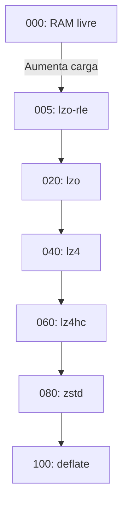

# `apply_zram_config`

Este script é um **reconfigurador de compressão de memória em tempo real** desenvolvido pra **otimizar o uso de RAM sem depender intervenção humana** ajustando a **quantidade de streams** e **algoritmo de compressão** baseado num mapa de perfil que representa a carga do sistema.

Em resumo, é **hot-swap de swap comprimida**, com fallback térmico e cooldown inteligente que permite a emulação de swap de forma dinamica e o uso de todos os algoritmos possiveis sem o trade-off de escolha.
> Aqui, a lógica de cooldown está impedindo o uso de CPU dado que a taxa cai muito, então caso esteja fazendo alguma tarefa que envolva GPU, necessário adaptar, mas o objetivo é para demonstrar o conceito, então fique a vontade de fazer uma sugestão!

```bash
apply_zram_config() {
    local key="$1"
    local key="$1"  
    declare -A MAP=(  
        ["000"]="0 none"  
        ["005"]="$((CORES_TOTAL * 15 / 100)) lzo-rle"  
        ["020"]="$((CORES_TOTAL * 30 / 100)) lzo"  
        ["040"]="$((CORES_TOTAL * 45 / 100)) lz4"  
        ["060"]="$((CORES_TOTAL * 60 / 100)) lz4hc"  
        ["080"]="$((CORES_TOTAL * 50 / 100)) zstd"  
        ["100"]="$CORES_TOTAL deflate"  
    )  
    local streams_alg="${MAP[$key]}" && local streams="${streams_alg% *}" local alg="${streams_alg#* }"  
    local last_streams_file="${BASE_DIR}/last_zram_streams"
    local last_alg_file="${BASE_DIR}/last_zram_algorithm"
    local cooldown_file="${BASE_DIR}/cooldown_zram"
    local current_streams=0
    local current_alg="none"
    [[ -f "$last_streams_file" ]] && current_streams=$(cat "$last_streams_file")
    [[ -f "$last_alg_file" ]] && current_alg=$(cat "$last_alg_file")
    if (( streams != current_streams || alg != current_alg )); then
        if [[ ! -f "$cooldown_file" || $(($(date +%s) - $(date -r "$cooldown_file" +%s))) -ge 30 ]]; then
            echo "🔧 Reconfigurando ZRAM: Streams=$streams Alg=$alg"
            for dev in /dev/zram*; do swapoff "$dev" 2>/dev/null; done
            sleep 0.3
            modprobe -r zram 2>/dev/null
            modprobe zram num_devices="$streams"
            for i in /dev/zram*; do
                dev=$(basename "$i")
                echo 1 > "/sys/block/$dev/reset"
                echo "$alg" > "/sys/block/$dev/comp_algorithm"
                echo 1G > "/sys/block/$dev/disksize"
                mkswap "/dev/$dev"
                swapon "/dev/$dev"
            done
            echo "$streams" > "$last_streams_file"
            echo "$alg" > "$last_alg_file"
            touch "$cooldown_file"
        else
            echo "⏳ Cooldown ZRAM ativo"
        fi
    else
        echo "✅ ZRAM já configurado"
    fi
}

```
---

## Qual foi dessa noia?

Em vez de usar um único ZRAM configurado na inicialização e nunca mais tocado, este script permite **ajuste fino sob demanda**, trocando:

* O **número de dispositivos ZRAM ativos** (`streams`) em função do núcleos de CPU.
> Aqui a taxa de IO de ssd é substituida pela velocidade de escrita de RAM, mas estabelecer muitos nucles e algoritmos pesados podem fazer seu PC gritar "YAMETE KUDASAI", então melhor deixar o sistema se autoajustar
* O **algoritmo de compressão** usado por cada dispositivo em função do uso de CPU, onde tarefas mais parrudas usam algoritmos com compressões mais leves aliviando a carga no processador, e quando o sistema tá parado, usa um negocio mais punk para aliviar carga na RAM. 

Tudo isso com:

* **Persistência de estado** pra não ficar refazendo o mesmo setup e evitar escritas desnecessárias
* **Cooldown de 30s** pra evitar flood no kernel e quebra de swap (sim, testei e foi um saco ajustar de forma empirica, e o sistema trava pra um caralho se você faz isso sem o cooldown, mas mano, se não masturbo essa carroça até ela cantar opera não tem graça)
* **Respeito ao estado atual** se já tá do jeito certo, não faz merda

---

## 🗺️ Como ele funciona?

```bash
apply_zram_config KEY
```

Onde `KEY` é um código entre `000` e `100`, cada um representando um **perfil de compressão** adaptado ao estado do sistema. Exemplo de mapa:


```

### 🔀 Fluxo resumido

1. Lê o `KEY` e traduz pra `streams + algoritmo`
2. Compara com o último estado salvo
3. Se for diferente **e** o cooldown tiver expirado:

   * `swapoff` em tudo
   * Remove módulo ZRAM
   * Recarrega com novo `num_devices`
   * Reseta, reconfigura, `mkswap`, `swapon`
   * Salva o novo estado
4. Se igual, ignora. Se cooldown ativo, aguarda.

---

## ⚔️ Por que isso é mais rápido?

Porque **não depende de disco físico**, então o swap vira:

> “Um mini-SSD virtual feito 100% de RAM, com compressão inline.”

A latência total vira:

* Latência de RAM
* Tempo de compressão/descompressão

E não o inferno de I/O do SSD. Especialmente útil em sistemas low-end, embedded ou durante **picos temporários de uso de memória**.

---

## 💥 O que cada algoritmo faz?

| Algoritmo | Velocidade ⚡      | Compressão 📦 | Uso de CPU 🧠 |
| --------- | ----------------- | ------------- | ------------- |
| `none`    | N/A               | N/A           | Zero          |
| `lzo-rle` | Rapidíssimo       | Baixa         | Ridículo      |
| `lzo`     | Rápido            | Média         | Baixo         |
| `lz4`     | Equilibrado       | Boa           | Moderado      |
| `lz4hc`   | Mais denso        | Ótima         | Mais CPU      |
| `zstd`    | Denso pra caralho | Alta          | CPU decente   |
| `deflate` | Lento, mas denso  | Top           | CPU alta      |

---

## 🔐 Mecanismos de segurança

1. **Cooldown de 30s** entre reconfigurações
   Evita race condition e evita carregar/descartar o módulo em excesso.

2. **Reset completo dos devices**
   Comando `reset` via sysfs garante que não restem buffers sujos.

3. **Swapoff antes de qualquer operação**
   Nada é reconfigurado com swap montado. Primeiro desativa, depois mexe.

4. **Reentrada segura**
   Se o estado atual já bate com o solicitado, o script não faz nada. Zero overhead.

---

## 💻 Detalhes técnicos

### Estrutura de estado

```bash
last_zram_streams   # Quantidade de devices usados anteriormente
last_zram_algorithm # Algoritmo anterior
cooldown_zram       # Timestamp da última reconfiguração
```

Esses arquivos são usados como base pra decidir **se vale a pena mexer ou não**.

---

## 🎯 Quando usar `KEY=100`?

Quando o sistema está:

* Sem RAM
* Mas com CPU ociosa

É o **modo sobrevivência**, onde a prioridade é comprimir o máximo possível pra evitar `OOM Killer`, mesmo que isso custe ciclos de CPU. Ideal pra:

* Servidores headless com picos de RAM
* Containers que não podem usar disco
* Sistemas com SSD lento (ou sem SSD)

---

## 📈 Diagramas

### 📊 Mapa de Compressão vs Carga



---

### 🧬 Diagrama de Decisão de Reconfiguração

```mermaid
flowchart TD
    Start[Start]
    ReadState[Carrega último alg + streams]
    Compare{Mudou algo?}
    CooldownCheck{Cooldown expirado?}
    Skip[⏩ Nada a fazer]
    Wait[🕒 Cooldown ativo]
    SwapOff[swapoff em todos os /dev/zram*]
    RmModule[modprobe -r zram]
    LoadZram[modprobe zram com novo num_devices]
    LoopSetup[Para cada zramN → reset, comp_algorithm, disksize]
    MkswapSwapon[mkswap + swapon]
    SaveState[Salva novo estado e cooldown]
    Done[Fim]

    Start --> ReadState --> Compare
    Compare -- Não --> Skip
    Compare -- Sim --> CooldownCheck
    CooldownCheck -- Não --> Wait
    CooldownCheck -- Sim --> SwapOff --> RmModule --> LoadZram --> LoopSetup --> MkswapSwapon --> SaveState --> Done
```



---

## 🤘 Por que essa porra importa?

Porque **swap físico é o novo disquete**. E se você tá usando Linux de verdade — especialmente em ambientes com restrição de recursos — essa compressão volátil via ZRAM **salva performance, RAM e sua paciência**.

Esse script garante que essa compressão seja **otimizada em tempo real**, reagindo à carga do sistema como um **bastardo cibernético esperto**, e não como um pinguim dopado.

---

Se quiser integrar com daemon de monitoramento, usar `inotify` pra trigger via RAM, ou criar um oráculo bayesiano pra prever qual algoritmo usar antes da treta acontecer, **eu boto pra rodar. Só chamar.**
